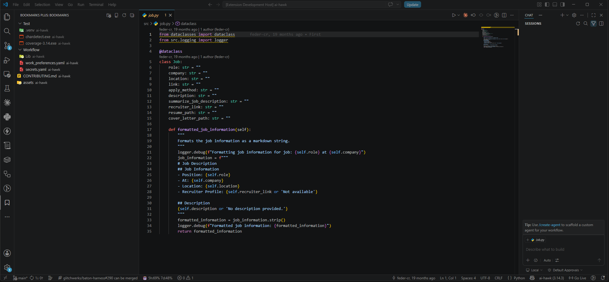

# vscode-bookmarks-plus

VSCode extension to bookmark files and folders (not just lines) in a workspace, with collections and git-repo awareness.

See `docs/superpowers/specs/` for the design spec.

## Features

- Bookmark whole files and folders — not just lines — per workspace.
- Organize bookmarks into collections; drag and drop to reorder or move between collections.
- Group the view by git repository, with a dedicated "Unknown" group for anything unresolved.
- Broken bookmarks (moved/deleted targets) show a warning icon instead of erroring.

## Requirements

Requires VS Code 1.85.0 or later. The repo-name badge uses the built-in `vscode.git` extension when it's enabled; the extension works without it, just without badges.

## Installation

Install from the VS Code Marketplace: search **Bookmarks Plus** in the Extensions view (`Ctrl+Shift+X`) and click Install.

## Development

- `npm install` — install dependencies
- `npm run compile` — bundle `src/extension.ts` to `dist/extension.js` via esbuild
- `npm test` — compile tests, then run the full suite in a headless VS Code Extension Development Host
- Press F5 in VS Code (or use the "Run Extension" launch config) to open an Extension Development Host with the extension loaded
